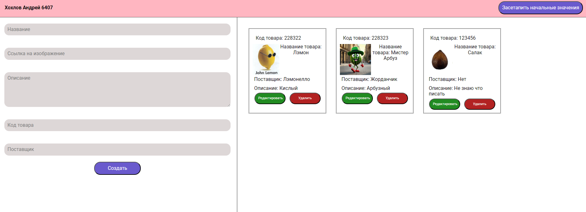
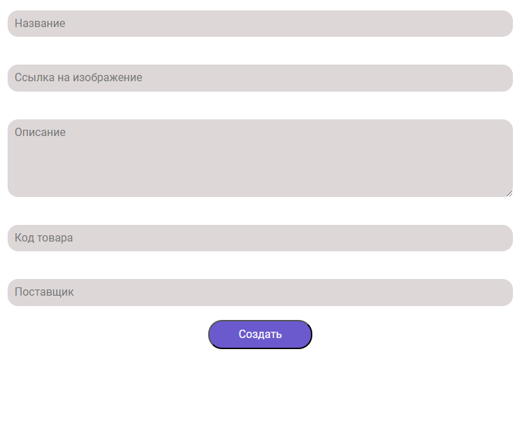
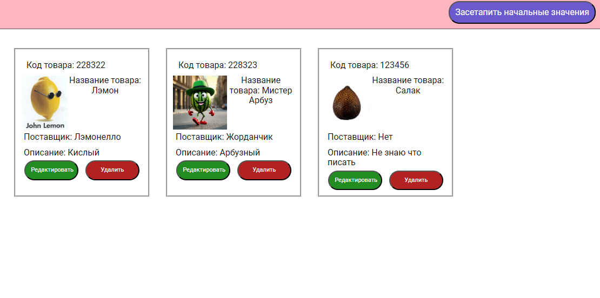
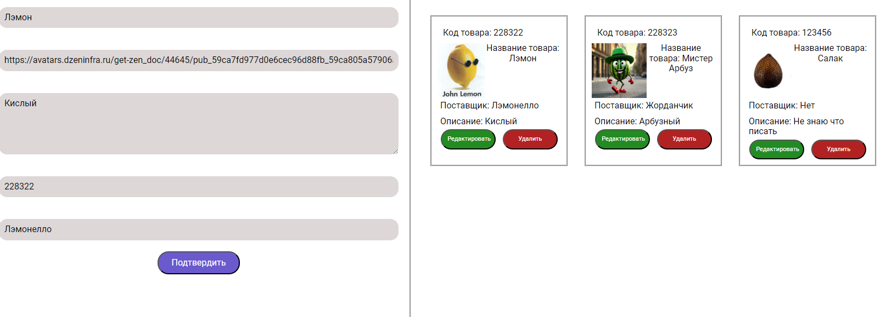

Админка карточек:

Создание карточки:

Начальные карточки с кнопкой сетапа:

Есть возможность редактировать карточку товара через форму или удалить её.

Запускать так:
1. Клонируешь репозиторий
2. npm i
3. npm run build
4. npm dev

Запуск сервера:
1. npm install -g json-server
2. json-server --watch database.json